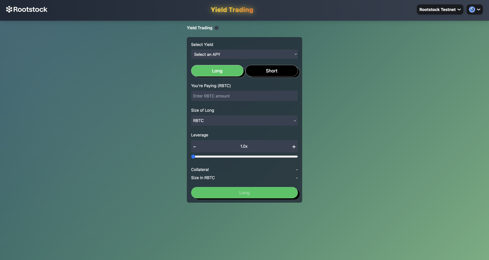

# APEY Fi: Monkey Around with APY



## Project Overview

Our platform allows trading on whether the interest earned from staking (APY) for platforms like Lido will increase or decrease. You can use EVM locked Bitcoin (RBTC) to bet on the largest project in the space with the largest crypto in the market.

## Rootstock Integration

We built a new leveraged DeFi trading derivative with Rootstock where you can bet on yield protocol APY over time. This DeFi app uses the Rootstock network as the token for placing trades, allowing BTC to be utilized for a new DeFi application across many EVM products.

## Supported Networks

- Rootstock Mainnet
- Rootstock Testnet

## Team

[Add team information here]
## Team

### Bart Hofkin
- Developer on a mission to change the game in the startup world
- Background in Computational Physics from the University of Illinois
- Several Hackathon wins
- Experience as an entrepreneur
- Proud owner of the world's best cat

### Eric Zarnesky
- US Army Special Operations Veteran
- Diverse experience including:
  - Airborne Operations
  - Tutoring
  - Event management
  - Marketing
  - Cancer Research
  - Yoga Teaching
  - Community service
  - Public speaking
  - Software and hardware development
  - Construction

## Setup and Usage

### 1. Clone Repository

```shell
git clone https://github.com/ABusyHippie/ETHGlobalSingapore.git
cd ETHGlobalSingapore
```

### 2. Install Dependencies

> **Note**: We recommend using yarn package manager due to conflicts when installing some packages with npm.

```shell
yarn
```

### 3. Run Project (Front End)

```shell
yarn dev
```

### 4. Install Rust (Optional, for Backend Development - "backend" branch)

If you want to work on the backend components:

1. Visit [https://www.rust-lang.org/tools/install](https://www.rust-lang.org/tools/install)
2. Follow the installation instructions for your OS:
   - Windows: Download and run `rustup-init.exe`
   - macOS/Linux: Run `curl --proto '=https' --tlsv1.2 -sSf https://sh.rustup.rs | sh`
3. Follow the prompts to complete the installation
4. Restart your terminal and verify the installation:
   ```shell
   rustc --version
   cargo --version
   ```

### 5. Build and Run Rust Backend (Optional)

```shell
cd src
cargo build -r
cargo run -r
```

## Feedback on Building with Rootstock

Building on Rootstock presented several challenges:

1. The Hardhat starter template was outdated and incompatible with current node expectations.
2. Specific RPC handler templates were required for CRON job ingestion, but the RPC data structure was unclear due to lack of examples.
3. We had to deploy using Remix because the Hardhat template was outdated, and creating custom deployment scripts proved difficult.
4. Documentation around Hardhat wasn't helpful since Remix deployment was much quicker.
5. EIP 1559 transactions aren't supported on Rootstock (still on Shanghai), making development more challenging due to being several versions behind.

## Demo

[Slide Deck](https://gamma.app/docs/APe-1z9cktvspei7zf9?mode=doc)


